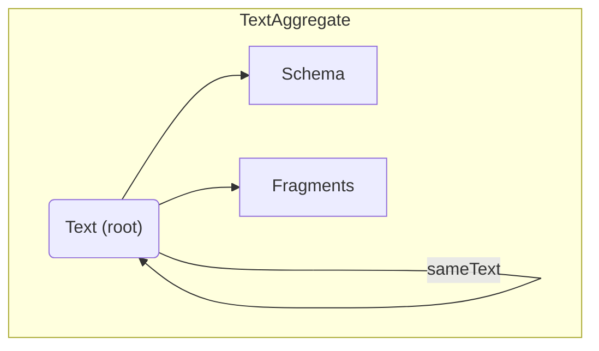
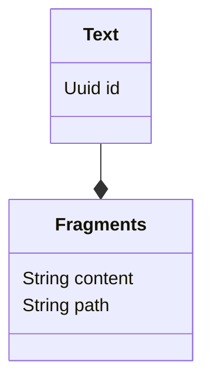

# Domain model

```mermaid
graph TD
    subgraph TextAggregate
        text("Text (root)") --> Schema
        text --> Fragments
    end

    text -- sameText --> text
```

```mermaid
classDiagram
Text --* Fragments
Text : Uuid id
Fragments : String content
Fragments : String path
```
